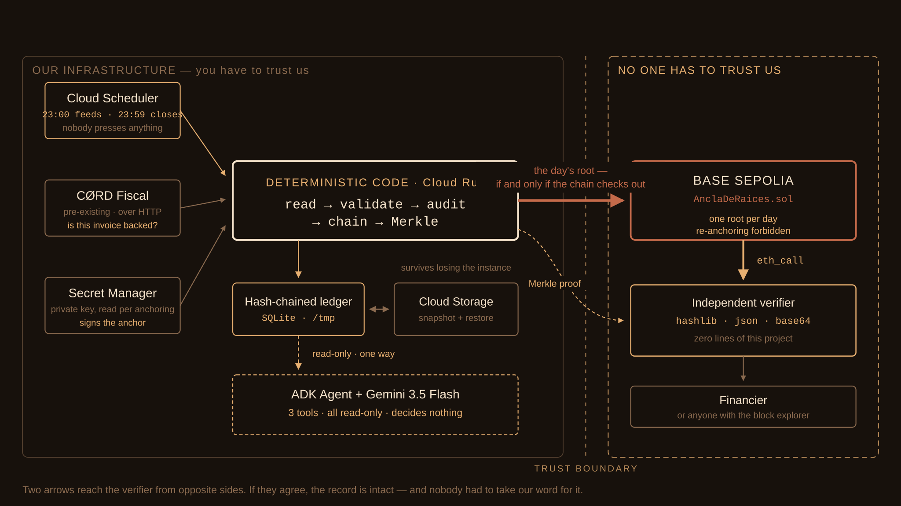

# Agente de Aseguramiento y Cesión de CFDI

[](https://github.com/LancelotPinajr/agente-cfdi-auditoria/actions/workflows/pruebas.yml)

**🇬🇧 [Read this in English](README.en.md)** — traducción completa. Este archivo es la
fuente de verdad: el código, la API y los eventos de log están en español.

Un agente que audita CFDI de una PYME mexicana, los escribe en una bitácora
encadenada por hash, detecta cuando una factura se intenta ceder dos veces, y
publica la raíz de la evidencia del día — de modo que un financiador pueda
verificarla **sin confiar en nosotros**.

> **El anclaje ya es real, en testnet.** La raíz del día se publica en un
> contrato propio en Base Sepolia y cualquiera puede comprobarla en el
> explorador sin pedirnos nada. **No sube a mainnet, y es una decisión**, no un
> pendiente: lo que separa testnet de mainnet no es la verificabilidad sino la
> permanencia y el valor económico — ver [la sexta frontera](docs/05-alcance-y-no-objetivos.md).
> Cada respuesta declara en qué red se ancló y si es verificable por terceros,
> así que la diferencia nunca queda escondida.

Escrito para el [All Things Agentic Hackathon](https://allthingsagentichackathon.devpost.com/),
categoría *Fortified Enterprise Fleet*.

---

## El problema

Una PYME con CFDI ya timbrados y cobrables a 30–90 días necesita liquidez. El
factoraje existe, pero el financiador enfrenta dos riesgos que hoy se cubren con
confianza y papeleo:

1. **¿Los libros de esta PYME son fieles?** Auditar cuesta y no escala.
2. **¿Esta factura ya fue cedida a alguien más?** Es *el* fraude del factoraje:
   la misma cuenta por cobrar vendida dos veces.

Una cadena de hashes por sí sola **no resuelve el segundo problema**. Encadenar
prueba que nosotros no alteramos nuestra bitácora; no impide ceder dos veces el
mismo UUID. Lo que sí lo impide es un registro de cesiones **verificable por
terceros** — y por eso el anclaje no es decoración.

## El ciclo que el agente ejecuta solo

```
  1. INGESTA      lote de CFDI XML que sube la PYME
  2. VALIDACIÓN   estructura, UUID, emisor, receptor, monto, fecha
  3. AUDITORÍA    contrasta contra los libros de la PYME (CØRD Fiscal, por HTTP)
  4. REGISTRO     escribe en bitácora encadenada por hash
  5. DETECCIÓN    ¿este UUID ya fue cedido? → alerta
  6. EXPEDIENTE   arma el dossier de cesión para el financiador
  ─── al cierre del día ───
  7. MERKLE       árbol con los hashes del día → una sola raíz
  8. ANCLAJE      una transacción con la raíz
  9. PRUEBA       endpoint que devuelve la prueba de Merkle + el tx hash
```

Los pasos 1–6 corren por lote; 7–9 los dispara un job diario. Nada de esto se
pide paso a paso.

## El mapa



Dos cosas están dibujadas para verse antes de leerse: **dónde termina nuestra
infraestructura** —la verificación ocurre del otro lado de esa línea— y que **el
modelo está fuera de la ruta del dato**, colgando de la bitácora con una flecha
de solo lectura. Detalle en [docs/arquitectura.md](docs/arquitectura.md).

---

## Stack

| Componente | Tecnología |
|---|---|
| Modelo | Gemini 3.5 Flash (`gemini-3.5-flash`, versión `3.5-flash-05-2026`) |
| Framework de agentes | Google ADK |
| Infraestructura | Google Cloud Run |
| Job diario | Cloud Scheduler |
| Secretos | Secret Manager |
| Alertas | Cloud Monitoring — dos políticas, ver «Observabilidad» |
| Anclaje | Base (contrato propio en Solidity, `web3.py`) |

### Nota sobre el modelo

Se usa el id exacto y no un alias `*-latest`, para que la versión sea
verificable por un jurado. Descartados: familia 2.5 (por debajo del requisito de
3.5+) y variantes EAP/Confidential.

Verificado el 16-ago-2026 **vía Vertex AI** con Application Default Credentials.
La migración desde Gemini API está hecha: el prepago de AI Studio se agotó
(`429 RESOURCE_EXHAUSTED`) y la facturación del proyecto de GCP es independiente
de aquél, así que Vertex es la vía sostenida — y es la misma que corre en Cloud
Run, sin API key de por medio.

**La ubicación es `global`, no `us-central1`.** `gemini-3.5-flash` no está
publicado en `us-central1` y ahí devuelve 404. `us-central1` es la región del
despliegue de Cloud Run; son dos cosas distintas y confundirlas rompe el arranque.

**Ninguna afirmación de integridad del sistema pasa por el modelo.** El hash, el
encadenamiento, la detección de doble cesión y la prueba de Merkle son código
determinista con pruebas; el modelo orquesta y redacta, no decide si un CFDI está
respaldado. Por eso Flash alcanza —no hay tier Pro en 3.5+— y por eso el veredicto
es auditable sin confiar en el modelo.

---

## Estado

| Pieza | Estado |
|---|---|
| Serialización canónica `CORD-CANON-2` | ✅ implementada y congelada |
| Generador de CFDI sintéticos | ✅ |
| Lector de CFDI 4.0 | ✅ |
| Fuente de libros (sintética + CØRD Fiscal) | ✅ |
| Verificación del modelo | ✅ vía Vertex AI (16-ago) |
| Bitácora encadenada | ✅ |
| Registro de cesiones | ✅ |
| Endpoints de ingesta y cesión | ✅ |
| Cotejo contra los libros | ✅ |
| Prueba de inclusión (Merkle) | ✅ |
| Agente ADK en Cloud Run | ✅ desplegado y verificado en producción |
| Integración de los dos servicios | ✅ la URL pública expone la auditoría en `/auditoria` |
| Cierre diario real | ✅ verifica la cadena y ancla; ya no es un stub |
| Semáforo de integridad | ✅ |
| Autenticación de escrituras | ✅ leer es libre, escribir exige token |
| Alertas del job diario | ✅ dos políticas, confirmadas con una alerta real |
| Llave del anclaje en Secret Manager | ✅ se lee en cada anclaje, rotable sin redesplegar |
| Contrato de anclaje | ✅ desplegado en Base Sepolia |
| Anclaje en red real | ✅ publicando, con prueba verificada contra la cadena |
| Ciclo autónomo diario | ✅ dos jobs encadenados: alimenta a las 23:00, ancla a las 23:59 |
| Restauración al arranque y respaldo a GCS | ✅ la bitácora sobrevive a perder la instancia |
| Anclaje en mainnet | ⛔ **no se hace** — decidido el 26-ago, [sexta frontera](docs/05-alcance-y-no-objetivos.md) |

397 pruebas. El núcleo verificable —canon, hashes, cadena, Merkle, cotejo— no
depende de nada externo; FastAPI, uvicorn y httpx entran solo en el borde HTTP.

---

## Requisitos

- Python 3.11+
- Cuenta de Google Cloud con facturación activa (para el smoke test del modelo)
- `gcloud` CLI instalado y autenticado

## Arranque local

En Windows, PowerShell bloquea scripts por defecto:

```powershell
Set-ExecutionPolicy -Scope Process -ExecutionPolicy Bypass
```

Entorno, dependencias y pruebas:

```bash
python -m venv .venv
source .venv/bin/activate          # Windows: .\.venv\Scripts\Activate.ps1
pip install -e ".[dev]"
pytest
```

Autenticación (no hace falta API key):

    gcloud auth login
    gcloud config set project project-d0428141-1b39-47af-9bc
    gcloud auth application-default login

Prueba de humo:

    python smoke_test.py

Debe imprimir la línea del backend seguida de `ok`, así:

    Vertex AI (project-d0428141-1b39-47af-9bc / global) | gemini-3.5-flash -> ok

## Variables de entorno

Ninguna es obligatoria en local: los defaults del código apuntan a Vertex con
ADC y al proyecto de abajo.

| Variable | Descripción |
|---|---|
| `GOOGLE_GENAI_USE_VERTEXAI` | `1` para Vertex (default). Manda sobre todo lo demás |
| `GOOGLE_CLOUD_PROJECT` | `project-d0428141-1b39-47af-9bc` |
| `GOOGLE_CLOUD_REGION` | `global` — ubicación del **modelo**, no del despliegue |
| `GEMINI_MODEL` | Sobrescribe el id del modelo. Default `gemini-3.5-flash` |
| `GOOGLE_API_KEY` | Solo para la vía Gemini API. Hoy sin créditos; no se usa |
| `AGENTE_CFDI_FUENTE` | `sintetica` (por omisión) o `cord_fiscal` |
| `CORD_FISCAL_URL` | Base de la API de CØRD Fiscal |
| `CORD_FISCAL_TOKEN` | JWT del agente para esa PYME — de Secret Manager, nunca del repo |
| `AGENTE_CFDI_SEMILLA` | Semilla del lote sintético |
| `AGENTE_CFDI_BITACORA` | Ruta del SQLite. En Cloud Run, `/tmp/bitacora.db` |
| `AGENTE_CFDI_INQUILINO` | RFC del contribuyente. Default `DEMO000000XX0` |
| `AGENTE_CFDI_TOKEN_ESCRITURA` | Token que exigen los endpoints que escriben |
| `AGENTE_CFDI_ANCLA_RED` | `base-sepolia`, `base`, `polygon-amoy` o `polygon`. Vacía = ancla simulada |
| `AGENTE_CFDI_ANCLA_CONTRATO` | Dirección del contrato de anclaje |
| `AGENTE_CFDI_ANCLA_RPC` | Sobrescribe el RPC público de la red |
| `AGENTE_CFDI_LLAVE_SECRETO` | Nombre del secreto con la llave privada. **Ruta de producción** |
| `AGENTE_CFDI_LLAVE` | Llave privada en texto plano. **Solo desarrollo contra testnet** |

Las tres del anclaje van juntas: si defines `AGENTE_CFDI_ANCLA_RED` y falta el
contrato o la llave, el servicio **levanta** en vez de caer a simulada. Un
despliegue que crea estar anclando en mainnet mientras firma constancias de
mentira es el escenario que este proyecto existe para no producir.

Sin configurar nada, el agente corre contra la fuente sintética: quien clona el
repo obtiene una demo que funciona, no un error de credenciales.

Si defines `GOOGLE_API_KEY` en un `.env`, ten en cuenta que `load_dotenv()` la
reinyecta en cada arranque: para forzar Vertex de todos modos, pon
`GOOGLE_GENAI_USE_VERTEXAI=1`, que tiene precedencia.

## Arquitectura del agente

El agente vive en `agente/agent.py` como `root_agent`, un `LlmAgent` de ADK —el
nombre que ADK busca por convención al cargar un directorio de agentes—, y la
ejecución la lleva un `Runner` de ADK. `main.py` es solo transporte HTTP para
Cloud Run: no contiene lógica de agente. Esa separación permite levantar el mismo
agente con `adk run` en local sin arrastrar el servidor.

## Despliegue

URL pública: **https://agente-cfdi-run-xsxcmt7edq-uc.a.run.app**

    curl https://agente-cfdi-run-xsxcmt7edq-uc.a.run.app/
    curl -X POST https://agente-cfdi-run-xsxcmt7edq-uc.a.run.app/api/chat \
      -H "Content-Type: application/json" -d '{"message":"hola"}'

    .\deploy.ps1

El script usa `--source .`, así que Cloud Build compila el `Dockerfile` sin que
haya que construir la imagen a mano.

### Permiso que hay que dar una sola vez

En proyectos de GCP creados recientemente, la cuenta de servicio por defecto de
Compute —la que usa Cloud Build— no recibe permisos automáticamente, y el
despliegue desde fuente falla con un 403 sobre el bucket `run-sources-*`:

    gcloud projects add-iam-policy-binding project-d0428141-1b39-47af-9bc \
      --member="serviceAccount:1031368580327-compute@developer.gserviceaccount.com" \
      --role="roles/cloudbuild.builds.builder"

### Automatización (Cloud Scheduler)

El job `job-cierre-diario` dispara `POST /api/cierre-diario` todos los días a las
`23:59`, con 3 reintentos.

Hasta el 16-ago apuntaba a un dominio que no existía y por eso nunca ejecutó. Ya
quedó repuntado a la URL real y corre todas las noches desde el 17-ago; la
evidencia de la primera corrida está en
[`docs/evidencias/2026-08-17-job-diario.md`](docs/evidencias/2026-08-17-job-diario.md).

**Esas primeras corridas pegaron contra un stub y no anclaron nada.** El cierre
real se desplegó el 20-ago. Desde entonces el criterio de 2.9 está cumplido y
rebasado: **tres días consecutivos** —22, 23 y 24 de agosto— dejaron tres
anclajes, los dos últimos sin que nadie tocara nada. Ver
[`docs/evidencias/2026-08-24-ciclo-autonomo.md`](docs/evidencias/2026-08-24-ciclo-autonomo.md).

Un detalle que hay que mirar: el job dispara a las 23:59 de Ciudad de México
—05:59 UTC— pero la bitácora agrupa por **día UTC**. El cierre del día UTC corre
cuando ese día lleva seis horas, así que lo que se escriba después no queda bajo
ninguna raíz. El arreglo es disparar al final del día UTC:

    gcloud scheduler jobs update http job-cierre-diario       --location us-central1 --time-zone=Etc/UTC

## Endpoints

> **Hay dos aplicaciones y un solo despliegue.** El servicio de auditoría
> (`src/agente_cfdi/api/app.py`) tiene la lógica de CFDI, bitácora y Merkle; el
> del agente (`main.py`) es el transporte, y desde la tarea 1.13 monta al primero
> en `/auditoria`. Las rutas de la tabla de abajo son las de la aplicación: en la
> nube todas cuelgan de ese prefijo. Evidencia en
> [`docs/evidencias/2026-08-17-integracion-1.13.md`](docs/evidencias/2026-08-17-integracion-1.13.md).

### Servicio de auditoría — `src/agente_cfdi/api/app.py`

| Método | Ruta | Qué hace |
|---|---|---|
| `POST` | `/ingesta` | Sube un lote de CFDI XML: los lee, los audita contra los libros y los encadena |
| `POST` | `/cesiones` | Intenta ceder un folio a un financiador |
| `GET` | `/cesiones/{uuid}` | ¿Está tomado? (no dice a nombre de quién) |
| `GET` | `/bitacora/verificacion` | Recorre la cadena entera y reporta si es íntegra |
| `GET` | `/salud` | Sonda de vida. No verifica la cadena: eso es otro endpoint |
| `GET` | `/semaforo` | Verde, ámbar o rojo, con la fila del problema si la hay |
| `POST` | `/bitacora/anclaje` | Publica la raíz de Merkle del día |
| `POST` | `/cierre-diario` | Verifica la cadena y ancla. Lo dispara el job |
| `GET` | `/auditoria/prueba/{uuid}` | La prueba de inclusión, verificable sin nosotros |
| `GET` | `/anclajes` | Qué raíces se publicaron, en qué red y dónde se comprueban |
| `GET` | `/anclajes/{dia}` | Lo que quedó debajo de la raíz de ese día, hoja por hoja |
| `GET` | `/vista` | Lo mismo en HTML, redactado, para herramientas que importan una URL |
| `GET` | `/vista/anclajes` | Las raíces publicadas, en prosa |
| `GET` | `/vista/anclajes/{dia}` | Lo que cuelga de esa raíz, en prosa |
| `GET` | `/consola` | Consola en el navegador para ingerir, ceder y cerrar el día |

### Dos superficies HTML, y por qué son dos

El mismo motor sirve dos páginas que parecen la misma cosa y no lo son. Separarlas
es la decisión, no un accidente de organización.

| | `/vista` | `/consola` |
|---|---|---|
| **Para quién** | Una herramienta que importa la URL como fuente (NotebookLM y parecidas) | Una persona con un navegador |
| **Qué hace** | Redacta en prosa el semáforo, las raíces publicadas y lo que cuelga de cada una | Ingiere lotes, registra cesiones, cierra el día y le pregunta al agente |
| **JavaScript** | Ninguno | Sí — el token viaja en un encabezado, y eso no se hace con un `<form>` |
| **Escribe** | No | Sí, con token |

**`/vista` no lleva un bloque `<style>` y eso es deliberado.** Un extractor de texto
que quita etiquetas sin tratar `<style>` aparte se traga el CSS *como si fuera prosa*,
y la fuente que el cuaderno guarda empieza con media hoja de reglas de tipografía.
Todo el formato va en atributos `style=` de cada etiqueta. Hay una prueba que falla si
alguien reintroduce un bloque de estilos, y otra que falla si alguien mete un
formulario en las vistas.

**Cada página lleva la fecha del corte arriba y las salvedades abajo** —los CFDI son
sintéticos, testnet no es mainnet, la cadena no prueba quién escribió—, y van en todas
y no solo en la portada: nadie garantiza que se lea la portada antes que el detalle.
Una fuente congelada que afirma «la cadena está íntegra» sin decir de cuándo es esa
afirmación es exactamente el fallo que este proyecto existe para no cometer.

**La consola no guarda el token en ninguna parte.** Se teclea, vive en la memoria de
esa pestaña y viaja en `Authorization`, igual que haría `curl`. No se escribe en
`localStorage`, no va en la URL —donde quedaría en el historial, en los logs y en el
`Referer`— y no se persiste del lado del servidor. Que la página sea pública no abre
nada: sin token, las escrituras rechazan igual que siempre. La consola es un cliente
más, no una excepción al modelo de autenticación.

### Quién puede escribir

Leer es libre; escribir exige un token. La línea no está en el servicio, está en
la operación:

| Sin credencial | Exige `Authorization: Bearer <token>` |
|---|---|
| `/`, `/api/chat` | `POST /auditoria/ingesta` |
| `/auditoria/salud`, `/auditoria/semaforo` | `POST /auditoria/cesiones` |
| `/auditoria/bitacora/verificacion` | `POST /auditoria/bitacora/anclaje` |
| `/auditoria/auditoria/prueba/{uuid}` | `POST /api/cierre-diario` |
| `/auditoria/anclajes`, `/auditoria/anclajes/{dia}` | |
| `/auditoria/vista`, `/auditoria/vista/anclajes` | |
| `/auditoria/consola` (la página; las escrituras que dispara sí exigen token) | |

Que un tercero pueda verificar la cadena **sin pedirnos permiso** es la tesis del
proyecto: hay una prueba que falla si alguien le pone credencial a una lectura.

En Cloud Run sin token configurado, las escrituras devuelven `503`. Equivocarse
por omisión deja el sistema cerrado, no abierto. En local no se exige nada: ahí
la bitácora es un archivo con datos sintéticos.

Levantar y correr el escenario completo:

```bash
python -m uvicorn agente_cfdi.api.app:app --port 8000
```

```bash
python tools/demo.py
```

`tools/demo.py` genera el lote **con la misma semilla que usa la fuente de
libros**. Sin eso, los libros no contienen los folios que se suben y todo sale
`sin_respaldo` — no porque el auditor falle, sino porque se le pregunta por
facturas de otra empresa.

### Códigos de estado que significan algo

| Situación | Código |
|---|---|
| Folio ya cedido a **otro** financiador | `409` |
| Folio ya cedido al **mismo** (reintento de red) | `200`, idempotente |
| Libros inalcanzables | `503`, **no** «sin respaldo» |
| CFDI ilegible o duplicado dentro del lote | se reporta en `fallas`; el lote sigue |

**Hueco declarado:** el token distingue quién puede escribir, **no quién es**.
Un financiador con el token puede ceder a nombre de cualquiera. Antes de datos
reales hace falta autenticación por financiador; hoy el despliegue está atado a
un solo contribuyente y eso lo hace tolerable, no correcto.

### Servicio del agente ADK — `main.py` (lo desplegado)

- `GET /` : Health check. Devuelve el framework y el id del modelo en uso.
- `POST /api/chat` : Ejecuta un turno del agente ADK. Recibe
  `{"message": "hola"}` y acepta `session_id` opcional para hilar la conversación.
- `POST /api/cierre-diario` : Llamado por Cloud Scheduler. Verifica la cadena y
  ancla la raíz del día. **Exige token.** Si la cadena está rota no ancla y
  responde `500`: publicar la raíz de una cadena manipulada dejaría constancia
  permanente de datos corruptos.
- `/auditoria/*` : el servicio de auditoría, montado aquí.

**Este servicio está desplegado con `--allow-unauthenticated`**, así que sus
lecturas son públicas. Es deliberado para que el jurado pueda abrir la URL sin
pedir credenciales. Las escrituras dejaron de serlo el 20-ago.

## Observabilidad

Un job diario falla de dos maneras, y la segunda no dispara ninguna alarma por sí
sola:

| Política | Qué caza |
|---|---|
| **Cierre diario FALLIDO** | El cierre devolvió `5xx`: cadena rota o anclaje imposible |
| **Cierre diario NO CORRIÓ** | Silencio. El job se deshabilitó, se borró o dejó de disparar |

La segunda es la que importa: nadie devuelve error porque nadie corre. Se
descubre por casualidad tres semanas después.

    powershell -File ./configurar_alertas.ps1 -Email tu@correo.com

El script es idempotente y cada política lleva su propio instructivo dentro, que
viaja en el cuerpo del correo. La de cadena rota dice explícitamente **no
reintentar**.

No se usa una condición de ausencia para la segunda: el máximo que admite la API
son 23h30m y el job corre cada 24h exactas, así que la ventana vencería media
hora antes de cada cierre y la alerta gritaría a diario. Una alerta que avisa
todos los días es una alerta que se aprende a ignorar. Se suma la métrica sobre
una ventana móvil de 24 h con 30 minutos de tolerancia.

Verificado el 20-ago con una política desechable: el correo llega a la bandeja y
la documentación se ve en el cuerpo.

---

## Contrato en blockchain

**El anclaje es real y está corriendo.** El contrato
[`contratos/AnclaDeRaices.sol`](contratos/AnclaDeRaices.sol) guarda un `bytes32`
por día y emite evento; `AnclaEVM` firma y publica cumpliendo el mismo protocolo
que la simulada.

| | |
|---|---|
| Red | **Base Sepolia** (`chain 84532`) |
| Contrato | [`0xe76b981159307a79c77B29796F59087D6c13d974`](https://sepolia.basescan.org/address/0xe76b981159307a79c77B29796F59087D6c13d974) |
| Wallet que firma | `0x83C889F7C0866917288E5FCF14E9792096C95dDA` |

La dirección va aquí y no solo en la configuración **a propósito**: sin ella
publicada, un tercero no puede comprobar las raíces por su cuenta, y todo el
argumento del proyecto se cae.

**No se repite en mainnet.** Sería cambiar una variable y alrededor de un dólar
de gas al año, y aun así no se hace: Base Sepolia ya es una cadena pública
—cualquiera consulta estas transacciones sin pedirnos nada— y lo que mainnet
añade es permanencia y valor económico, que no es lo que este proyecto
demuestra. La decisión y su condición de reversión están en
[la sexta frontera](docs/05-alcance-y-no-objetivos.md).

### Cómo comprobar una raíz sin creernos

    curl -s <URL>/auditoria/auditoria/prueba/<UUID> > prueba.json
    python tools/verificar_prueba.py prueba.json

Eso recalcula la hoja y recorre el camino de Merkle. El último paso —comprobar
que la raíz a la que llega ese camino es la que está publicada en la red— lo
hace quien verifica, contra el contrato y no contra nosotros:

    python tools/leer_raiz_publicada.py 2026-08-24 <raiz-que-declara-la-prueba>

Ese script tampoco importa nada del proyecto: habla por JSON-RPC con un nodo
público de Base y no necesita ni `web3`. Quien prefiera no correr nada puede
consultar `consultar("AAAA-MM-DD")` en el explorador, que da lo mismo.

Verificado así los tres días anclados hasta ahora, idénticos en los dos lados:

| Día | Raíz publicada |
|---|---|
| `2026-08-22` | `3a540914bb5d42525c08f04c367b4f3069e4a21ebc66b57380b3e9fc2c8851a1` |
| `2026-08-23` | `fe20dcc2dbe7f8c975809d3369e52c2abde47a8f30f3626cd23a85f0572f083c` |
| `2026-08-24` | `d17a61403dbd1c31a00800fd4e37e06aa0938bc97032f7e480b2763e2d849a83` |

Los dos últimos se anclaron **sin intervención humana**; la evidencia con logs
correlacionados está en
[`docs/evidencias/2026-08-24-ciclo-autonomo.md`](docs/evidencias/2026-08-24-ciclo-autonomo.md).

El contrato **prohíbe reanclar un día**. Si un mismo día admitiera dos raíces,
quien guarda la bitácora podría publicar una, reescribir el historial y publicar
otra, y un tercero no sabría cuál creer. El artefacto compilado se versiona con
el `sha256` del fuente para que cualquiera recompile y compare contra lo que
quede en la cadena.

    python tools/compilar_contrato.py
    python tools/desplegar_contrato.py --red base-sepolia

El ancla simulada **se declara como tal** en cada respuesta
(`verificable_por_terceros: false`, más una advertencia en texto) y el
verificador sale con código 2 en vez de 0. Un ancla de mentira que pareciera real
sería peor que ninguna: pasaría por buena en un video de demo.

La llave privada vive en Secret Manager y se lee con `versions/latest` **en cada
anclaje**, no como variable de entorno: Cloud Run resuelve los secretos al
arrancar la instancia, y con `--min-instances=1` esa instancia vive días, así que
rotar no surtiría efecto hasta redesplegar. Es una petición al día.

    python generate_wallet.py --subir      # genera, guarda y reporta la dirección
    python generate_wallet.py --direccion  # qué dirección tiene el secreto

La llave nunca se escribe en disco ni pasa por la línea de comandos. Ver
[ADR 0006](docs/adr/0006-anclaje-y-prueba.md).

### Verificar una prueba sin confiar en nosotros

```bash
curl -s localhost:8000/auditoria/prueba/<UUID> > prueba.json
```

```bash
python tools/verificar_prueba.py prueba.json
```

Ese script **no importa una sola línea de este proyecto** — solo `hashlib`,
`json` y `base64`. Si la verificación usara nuestro código, comprobaría que
nuestro código coincide consigo mismo, que no demuestra nada.

Y el paso que cierra el lazo, contra la red:

```bash
python tools/leer_raiz_publicada.py <AAAA-MM-DD> <raiz-que-declara-la-prueba>
```

```
contenido del registro  →  hoja declarada         ✓   verificar_prueba.py
camino de Merkle        →  raíz declarada         ✓   verificar_prueba.py
raíz declarada          == raíz en la cadena      ✓   leer_raiz_publicada.py
```

---

## Datos de la demo: sintéticos, por diseño

La demo corre con CFDI **sintéticos**, no con facturas reales de una PYME. No es
una concesión:

- **Hace reproducible el proyecto.** Cualquiera clona el repo y levanta la demo
  completa sin necesitar facturas de nadie.
- **Permite grabar el escenario de manipulación sin censurar nada.**
- **Es coherente con nuestro propio aviso de privacidad.** El video es público y
  un CFDI real lleva datos patrimoniales identificables (LFPDPPP).

Los RFC generados llevan `000000` en la porción de fecha, que el SAT no puede
haber asignado nunca —no existe el día cero del mes cero— y que el esquema de
CFDI 4.0 acepta. Así **no pueden coincidir con los de una persona real**.

La fuente de datos es una interfaz con dos implementaciones —sintética y real—,
de modo que cambiar de una a otra es configuración, no reescritura. Pasar a datos
reales exige antes consentimiento expreso (LFPDPPP art. 8, por tratarse de datos
patrimoniales), minimización según el
[contrato del expediente](docs/contrato-expediente.md) y retención conforme al
CFF art. 30.

---

## Documentación

- [ADR 0001 — Serialización canónica `CORD-CANON-2`](docs/adr/0001-serializacion-canonica.md)
- [ADR 0003 — Lectura de CFDI](docs/adr/0003-lectura-de-cfdi.md)
- [ADR 0004 — Bitácora encadenada y registro de cesiones](docs/adr/0004-bitacora-encadenada.md)
- [ADR 0005 — Endpoints de ingesta y cesión](docs/adr/0005-endpoints.md)
- [ADR 0006 — Prueba de inclusión y anclaje](docs/adr/0006-anclaje-y-prueba.md)
- [ADR 0007 — El dominio del candado no es el dominio de la durabilidad](docs/adr/0007-dominio-del-candado-y-dominio-de-la-durabilidad.md) — por qué `--max-instances=1` es corrección y no costo
- [Arquitectura](docs/arquitectura.md) — el mapa, cómo leerlo, y qué deja fuera a propósito
- [Manejo de estado](docs/03-manejo-de-estado.md) — tareas 3.13 a 3.18
- [Alcance y no-objetivos](docs/05-alcance-y-no-objetivos.md) — las seis fronteras que el sistema no cruza, y por qué
- [Contrato de datos del expediente](docs/contrato-expediente.md) — qué sale, qué no, y por qué
- [Datos sintéticos](docs/datos-sinteticos.md) — RFC que no pueden ser de nadie, y huecos conocidos
- [Frontera con CØRD Fiscal](docs/trabajo-preexistente.md) — declaración verificable
- [Manual técnico](docs/manual-tecnico.md) — cómo funciona hoy, servicio por servicio
- [Manual de usuario](docs/manual-usuario.md) — cómo usarlo, contra la nube o en local
- [Evidencias](docs/evidencias/) — corridas reales con logs correlacionados
- [Bitácora](docs/bitacora/) — estado y decisiones por día
- [Conectores de Google Workspace](conectores/apps-script/) — la hoja como tablero y un buzón de Gmail como entrada de CFDI, fuera del agente y por qué

## Trabajo preexistente

Este agente se construyó íntegramente durante el periodo de submission; el
historial de git lo evidencia.

**CØRD Fiscal** es una plataforma **preexistente** de la que este agente consume
los libros contables de la PYME **por HTTP**, al mismo nivel que Postgres o
FastAPI. Nada de su código se copia ni se importa aquí — y no hay que creernos:

```bash
python tools/verificar_frontera.py ../cord_rag_plataform/backend/app
```

Al 14-ago: 3 coincidencias en 1062 líneas, las tres `from datetime import …`.
Detalle en [docs/trabajo-preexistente.md](docs/trabajo-preexistente.md).

## Licencia

MIT — ver [LICENSE](LICENSE).
