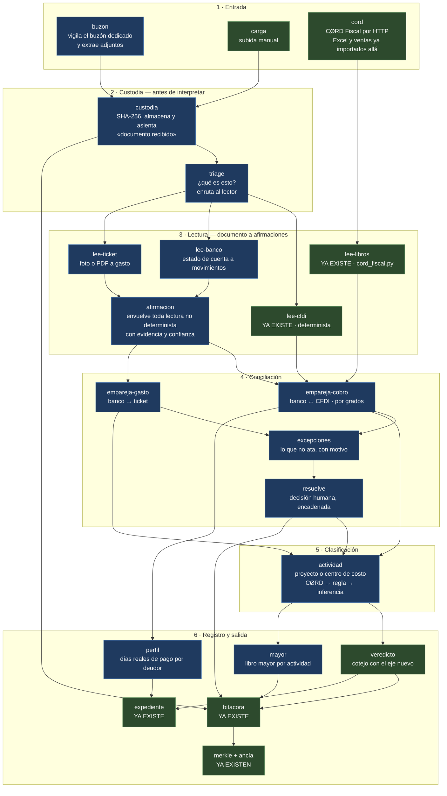

# Diseño de nodos — ingesta multifuente y contraste bancario

**Estado:** propuesta para aprobación · **Fecha:** 18 de agosto de 2026
**Horizonte:** posterior a la entrega del 31-ago-2026

Este documento define **qué hace el agente**, nodo por nodo. No es el plan de
implementación: el plan ágil y los servicios se escriben cuando esto quede
aprobado.

---

## 0. Las cuatro decisiones que fijan el diseño

| # | Decisión | Consecuencia |
|---|---|---|
| 1 | **Horizonte posterior al hackathon** | El plan se organiza en sprints reales. Lo desplegado hoy se entrega el 31-ago tal como está. |
| 2 | **El eje es el contraste contra el banco** | El estado de cuenta es el testigo. La contabilidad derivada es subproducto, no el fin. |
| 3 | **Frontera mixta** | Banco, tickets y correo viven en el agente nuevo. Excel y registro de ventas se quedan en CØRD Fiscal y se consumen por HTTP. |
| 4 | **Actividad = proyecto / centro de costo** | Se reutilizan los campos que CØRD Fiscal ya produce, en vez de inventar un catálogo. |

---

## 1. Qué cambia: el veredicto deja de preguntar lo mismo

Hoy `cotejar()` pregunta: **«¿la contabilidad de la PYME respalda este CFDI?»**
La contabilidad la escribe la PYME. Es su propia declaración.

Con el eje nuevo la pregunta es: **«¿hay dinero del banco detrás de este CFDI?»**
El banco no es parte interesada. Esa es toda la diferencia.

### 1.1 Veredictos nuevos

| Veredicto | Significa | Existe hoy |
|---|---|---|
| `RESPALDADO` | El movimiento contable existe y cuadra | sí |
| `MONTO_DISTINTO` | Existe pero por otro importe | sí |
| `SIN_RESPALDO` | No hay renglón que lo respalde | sí |
| **`COBRADO`** | **Hay un abono bancario identificado que lo salda** | **no** |
| **`COBRADO_PARCIAL`** | **Abono bancario por menos del total** | **no** |
| **`PENDIENTE`** | **No vencido y sin cobro: es normal, no es hallazgo** | **no** |
| **`VENCIDO_SIN_COBRO`** | **Pasó el vencimiento y no hay rastro bancario** | **no** |

`VENCIDO_SIN_COBRO` es el veredicto que justifica el proyecto entero. Es la
factura que un financiador **no** debería comprar, y hoy el sistema no la puede
distinguir de una sana.

### 1.2 El subproducto que vale más que el libro mayor

Con estados de cuenta históricos se puede **medir** cuántos días tarda de verdad
en pagar cada deudor, por RFC receptor.

El `contrato-expediente.md` ya dice que `dias_credito` y `fecha_vencimiento` son
«la variable de descuento» del factoraje. Hoy ese dato es **declarado**. Con el
banco pasa a ser **medido**, con evidencia. Un financiador paga por eso.

---

## 2. El mapa de nodos

Azul: construir. Verde: ya existe o se extiende.

---

## 3. Los nodos, uno por uno

### Banda 1 — Entrada

| Nodo | Qué hace | Estado |
|---|---|---|
| `buzon` | Vigila un buzón **dedicado** (no el correo personal del dueño). Extrae adjuntos y descarta el cuerpo del mensaje. | nuevo |
| `carga` | Subida manual por API o web. Ya existe para XML en `/auditoria/ingesta`. | extender |
| `cord` | Cliente HTTP a CØRD Fiscal. Ya existe; hay que **ampliar el contrato** para que traiga `proyecto`. | extender |

### Banda 2 — Custodia

| Nodo | Qué hace | Estado |
|---|---|---|
| `custodia` | Calcula SHA-256, guarda el archivo y asienta «documento recibido» en la bitácora — **antes de saber qué es**. La cadena de custodia empieza en la recepción, no en la interpretación. | nuevo |
| `triage` | Decide el tipo de documento y enruta. Primer nodo donde interviene el modelo; su decisión es reversible y no afecta la integridad. | nuevo |

### Banda 3 — Lectura

| Nodo | Qué hace | Estado |
|---|---|---|
| `lee-cfdi` | XML a comprobante. Determinista, sin modelo. | existe |
| `lee-banco` | PDF del banco a movimientos bancarios: fecha, descripción, cargo/abono, saldo. | nuevo |
| `lee-ticket` | Foto o PDF a gasto: fecha, monto, RFC emisor, concepto. | nuevo |
| `lee-libros` | Movimientos de CØRD Fiscal, ya minimizados. | existe |
| `afirmacion` | **Nodo transversal.** Toda lectura no determinista sale envuelta como afirmación, no como hecho. | nuevo |

### Banda 4 — Conciliación

| Nodo | Qué hace | Estado |
|---|---|---|
| `empareja-cobro` | Ata abonos bancarios con CFDI. Emite **grado de enlace**, no un sí/no. | nuevo |
| `empareja-gasto` | Ata cargos bancarios con tickets de compra. | nuevo |
| `excepciones` | Cola de lo que no ató, **con el motivo**. Nodo de primera clase, no un `else`. | nuevo |
| `resuelve` | Un humano decide. Su decisión se encadena: quién, qué y cuándo. | nuevo |

### Banda 5 — Clasificación

| Nodo | Qué hace | Estado |
|---|---|---|
| `actividad` | Asigna proyecto o centro de costo en tres saltos, en orden: lo que ya trae CØRD Fiscal → regla configurada por la PYME → inferencia del modelo (que es una afirmación, revisable). | nuevo |

### Banda 6 — Registro y salida

| Nodo | Qué hace | Estado |
|---|---|---|
| `veredicto` | El `cotejar()` de hoy, con los veredictos del §1.1. | extender |
| `mayor` | Libro mayor agregado por actividad y periodo. | nuevo |
| `perfil` | Días reales de pago por RFC receptor. | nuevo |
| `bitacora`, `merkle + ancla`, `expediente` | Sin cambios de diseño. Reciben tipos de evento nuevos. | existe |

---

## 4. Las tres reglas que sostienen el diseño

### 4.1 Afirmación, no hecho

El manual técnico presume que **ninguna afirmación de integridad pasa por el
LLM**. Leer la foto de un ticket es extracción por modelo, y si el libro mayor
sale de ahí, el modelo pasaría a ser el origen de los asientos.

La salida: lo que se encadena no es *«el ticket dice $4,350»* sino
*«el modelo M leyó $4,350 del documento cuyo hash es X, con confianza C»*.

Eso es una afirmación de **procedencia**, verificable por cualquiera que tenga el
documento, y no una afirmación de verdad. La tesis del proyecto sobrevive intacta.

### 4.2 El enlace tiene grados

`cotejo.py` dice hoy, con todas sus letras:

> «No se coteja por monto y fecha aproximados: dos facturas del mismo cliente por
> el mismo importe en la misma semana son indistinguibles así, y adivinar mal
> aquí produce un veredicto que parece riguroso y no lo es.»

Un estado de cuenta bancario **no trae el UUID del CFDI**. Conciliar contra el
banco obliga a hacer justo lo que ese párrafo prohíbe. La regla no se rompe: se
sustituye por una que distingue casos:

| Grado | Cuándo | Qué se puede afirmar |
|---|---|---|
| **exacto** | La referencia del movimiento trae el UUID o el folio | Enlace probado |
| **fuerte** | Monto, fecha y contraparte coinciden y el candidato es **único** | Enlace propuesto, se puede automatizar |
| **débil** | Coincide pero hay **varios** candidatos | Va a `excepciones`. Nunca se decide solo |
| **nulo** | Sin candidato | Va a `excepciones` |

Lo que se prohíbe no es aproximar: es **presentar una aproximación como un
hecho**. El grado viaja al expediente, y el financiador ve con qué firmeza está
atado cada peso.

### 4.3 La custodia antecede a la interpretación

El hash y el asiento «documento recibido» ocurren antes del triage. Si después se
descubre que el modelo leyó mal, el documento original sigue amarrado a la cadena
por su hash y el reproceso es auditable.

---

## 5. Lo que este diseño obliga a revisar

Tres decisiones ya escritas que hay que **derogar a propósito**, no por accidente.

### 5.1 `proyecto` vuelve a cruzar la frontera

`contrato-expediente.md` §3 declara que `fuentes/cord_fiscal.py` descarta
`datos_originales`, `categoria`, `problemas` y `proyecto` en la petición — como
minimización, y con el argumento de que «lo que no cruza la frontera no se puede
filtrar mal después».

La decisión 4 exige `proyecto`. Resolución propuesta: **cruza `proyecto` y sólo
`proyecto`**; `datos_originales`, `categoria` y `problemas` siguen sin cruzar. Y
`proyecto` se usa para agregar el mayor, pero **no viaja al expediente del
financiador**: saber en qué proyecto interno se clasificó un cobro no cambia el
precio de una cuenta por cobrar.

### 5.2 El estado de cuenta es una escalada de privacidad grande

Un CFDI revela una operación. Un estado de cuenta revela **todo**: proveedores,
nómina, saldos, la cartera completa. Es el salto más grande que ha dado este
sistema en superficie de datos personales.

Decisión pendiente: ¿los movimientos bancarios **sin relación** con un CFDI o un
ticket bajo auditoría se conservan, o se descartan tras la conciliación? Se
necesitan para el libro mayor y no se necesitan para el factoraje. Es el conflicto
central de esta fase y hay que resolverlo antes de escribir el primer parser.

### 5.3 El agente conversacional sigue con `tools=[]`

Hoy el LLM no puede consultar nada. En este diseño, los nodos **son** sus
herramientas: preguntar «¿ya me pagaron la factura de ACME?» debería ejecutar
`empareja-cobro` y responder con evidencia. Es lo que convierte esto de un
pipeline en un agente.

---

## 6. Lo que este diseño NO hace

Declarado para que nadie lo suponga:

- **No emite contabilidad electrónica del SAT.** Ni catálogo con código
  agrupador, ni balanza, ni pólizas en XML.
- **No hace partida doble.** El `Movimiento` de hoy no tiene cuenta contable ni
  cargo/abono. El «mayor» de este diseño es clasificación de flujos por
  actividad, no un mayor de contador.
- **No publica contabilidad.** Propone; un humano aprueba, y esa aprobación se
  encadena.
- **No lee el correo personal de nadie.** Buzón dedicado con reenvío.
- **No sustituye el importador de Excel de CØRD Fiscal.** Lo consume.
