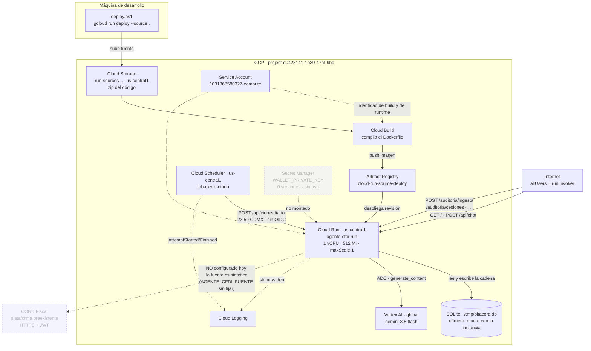
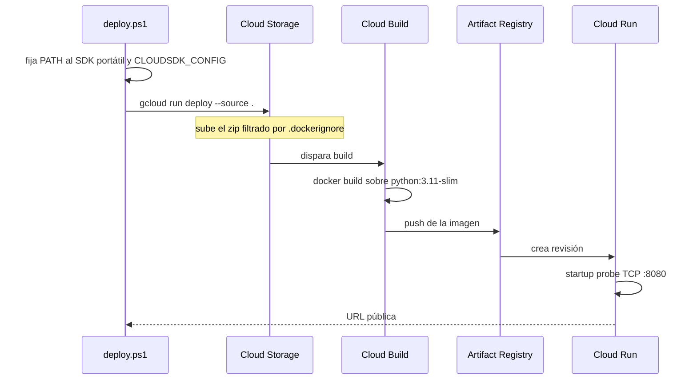
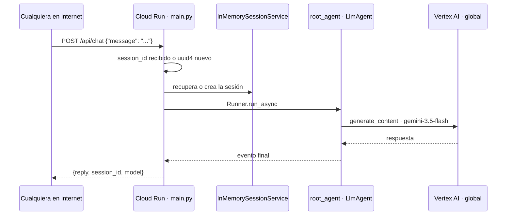
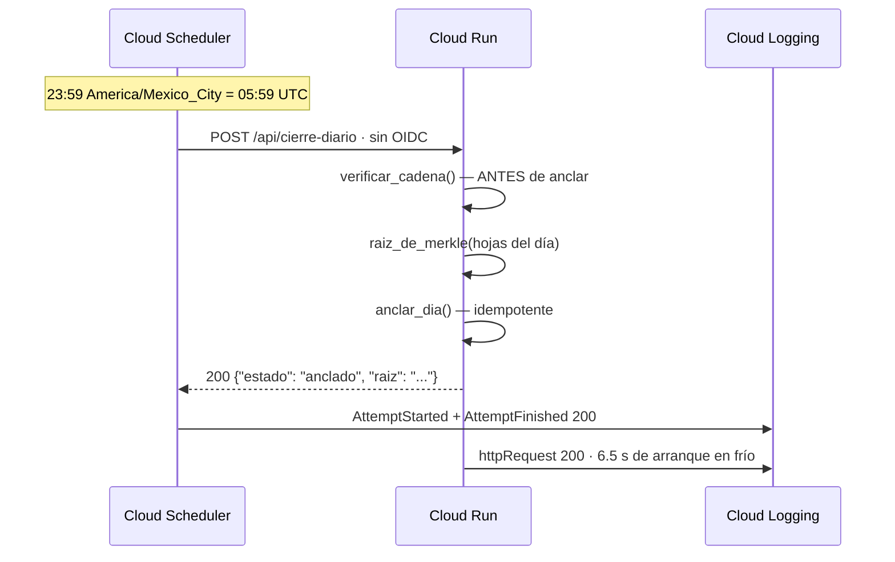
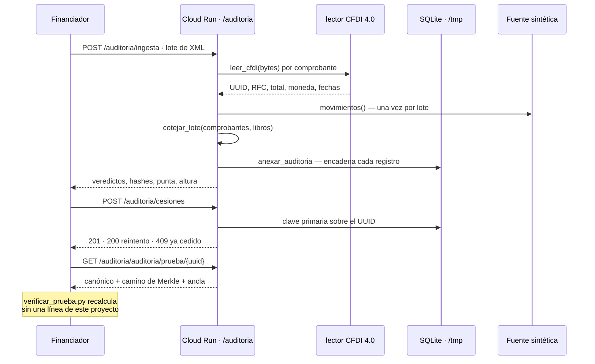
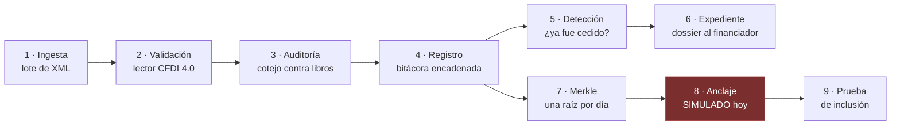

# Manual técnico — Agente CFDI

**Qué es este documento:** cómo funciona *hoy* el sistema, qué servicios de GCP
toca y cómo se relacionan. No es el diseño deseado ni el plan: es el estado
verificado.

**Verificado el 17-ago-2026** contra el proyecto real `project-d0428141-1b39-47af-9bc`
(número `1031368580327`) con el SDK portátil de esta máquina. Cada afirmación de
infraestructura de este manual sale de un comando reproducible; los comandos
están en el §11.

**Revisado el 17-ago-2026 por la tarde**, después de la tarea 1.13. Cambió lo
suficiente como para que la versión anterior fuera engañosa: el motor de auditoría
pasó de «no desplegado» a servir en `/auditoria`, y el inventario de brechas del
§10 se reordenó por completo.

---

## 1. La primera cosa que hay que entender: dos aplicaciones, un despliegue

El repositorio contiene **dos aplicaciones FastAPI**. Hasta el 17-ago-2026 solo
una estaba desplegada; desde la tarea 1.13, la primera monta a la segunda y el
servicio público sirve las dos.

| Aspecto | Servicio del agente | Servicio de auditoría |
|---|---|---|
| Punto de entrada | `main.py` | `src/agente_cfdi/api/app.py` |
| Rutas públicas | `/`, `/api/chat`, `/api/cierre-diario` | **`/auditoria/*`** |
| Qué hace | Conversa vía Gemini con ADK | CFDI, bitácora, Merkle, cesiones |
| Dependencias | `google-adk`, `google-genai` | `httpx`, `sqlite3`, stdlib |
| Estado | ✅ desplegado en Cloud Run | ✅ **desplegado, montado en `/auditoria`** |
| Lógica de negocio | ninguna | toda |
| Líneas del núcleo | ~130 | ~2 500 |

El montaje son dos líneas al final de `main.py`:

```python
from agente_cfdi.api.app import app as app_auditoria
app.mount("/auditoria", app_auditoria)
```

Va en `/auditoria` y no en `/api` porque un `Mount` en `/api` competiría con
`/api/chat` y `/api/cierre-diario`; hoy los ganarían por orden de registro, pero
eso es depender del orden de las líneas del archivo.

Lo que faltaba no era el montaje sino la instalación: `COPY . .` ya metía `src/`
en la imagen, pero nadie instalaba el paquete, así que `import agente_cfdi`
fallaba. El `Dockerfile` ahora hace `pip install --no-cache-dir --no-deps .`.

### Qué NO cambió con esto

- **El agente sigue con `tools=[]`** (`agente/agent.py:45`). El LLM todavía no
  puede consultar la bitácora: montar el motor lo hizo alcanzable por HTTP, no lo
  conectó al modelo.
- **`/api/cierre-diario` sigue siendo un stub.** Que el motor esté desplegado no
  conecta el job diario solo.

Evidencia de la integración, con logs correlacionados de Cloud Run:
[`docs/evidencias/2026-08-17-integracion-1.13.md`](evidencias/2026-08-17-integracion-1.13.md).

---

## 2. Mapa de servicios de GCP

### 2.1 Lo que está encendido y en uso

| Servicio | Recurso concreto | Papel |
|---|---|---|
| **Cloud Run** | `agente-cfdi-run` · `us-central1` · rev. `agente-cfdi-run-00002-b4c` · `maxScale: 1` | Único cómputo. Sirve el agente **y** la auditoría |
| **Vertex AI** | `aiplatform.googleapis.com` · ubicación `global` | Inferencia de `gemini-3.5-flash` |
| **Cloud Scheduler** | `job-cierre-diario` · `us-central1` | Dispara el cierre diario a las 23:59 CDMX |
| **Cloud Build** | build `74c202ea-…` | Compila el `Dockerfile` desde fuente |
| **Artifact Registry** | `cloud-run-source-deploy` · `us-central1` · 72 MB | Guarda la imagen resultante |
| **Cloud Storage** | `run-sources-project-…-us-central1` | Recibe el zip del código en cada `--source .` |
| **Cloud Logging** | — | Logs de request de Run y de intento de Scheduler |
| **IAM** | SA `1031368580327-compute@developer.gserviceaccount.com` | Identidad de build **y** de ejecución |

### 2.2 Lo que está encendido y NO en uso

| Servicio | Situación |
|---|---|
| **Secret Manager** | El secreto `WALLET_PRIVATE_KEY` existe (creado 17-ago 00:54) pero tiene **0 versiones**: está vacío. Cloud Run no lo monta. No hay wallet, porque no hay anclaje real |
| **Gemini API** (`generativelanguage`) | Vía abandonada. El prepago de AI Studio se agotó con `429 RESOURCE_EXHAUSTED`; se migró a Vertex |
| **Cloud Monitoring** | API encendida, **cero políticas de alerta**. Si el job falla mañana, nadie se entera |
| **Cloud SQL** | `sqladmin.googleapis.com` ni siquiera está habilitado. No hay base de datos administrada |

El resto de las ~60 APIs habilitadas (BigQuery, Pub/Sub, Dataplex, IAP…) vienen
encendidas por plantilla del proyecto y **el código no las toca**.

### 2.3 Cómo se relacionan



**Lo que este diagrama dice y conviene no perder de vista:**

- **No hay base de datos administrada.** La cadena vive en un SQLite sobre el
  disco efímero de la instancia. Es persistencia solo mientras la instancia viva.
- `maxScale: 1` no es ahorro de costo: con dos instancias cada una escribiría su
  propia cadena y la punta se bifurcaría. Es un parche hasta que haya
  persistencia compartida.
- Cloud Run no lee ningún secreto. Su única credencial es la ADC de la cuenta de
  servicio, y solo la usa contra Vertex.
- La flecha hacia CØRD Fiscal sigue punteada: el servicio ya está desplegado,
  pero corre contra la fuente **sintética**. Nunca ha consumido libros reales.
- Scheduler y el tráfico público entran por la misma puerta abierta — y ahora esa
  puerta también da a `/auditoria/ingesta` y `/auditoria/cesiones`.

### 2.4 Regiones: tres cosas distintas que se llaman parecido

Confundirlas rompe el arranque, y ya pasó una vez:

| Cosa | Valor | Por qué |
|---|---|---|
| Región de **Cloud Run** | `us-central1` | Dónde corre el contenedor |
| Región de **Scheduler** | `us-central1` | Debe coexistir con el servicio |
| Ubicación del **modelo** | `global` | `gemini-3.5-flash` **no está publicado en `us-central1`**: ahí devuelve 404 |

`main.py:46-49` traduce `GOOGLE_CLOUD_REGION` (lo que documenta el README) a
`GOOGLE_CLOUD_LOCATION` (lo que lee `google-genai`), con `global` por omisión.

---

## 3. Los tres recorridos que existen hoy

### 3.1 Despliegue



El `.dockerignore` deja fuera `.env`, `.venv`, `docs/`, `smoke_test*.py`,
`deploy.ps1` y el `README`. **La imagen no lleva secretos horneados** — esto es
correcto y hay que mantenerlo así.

Detalle operativo: el script fija `CLOUDSDK_CONFIG=D:\CORD\tools\gcloud-config-ricardo`
porque en esta máquina hay dos cuentas autenticadas. Desplegar sin eso puede
apuntar al proyecto equivocado.

Permiso que hubo que dar una vez — en proyectos nuevos la SA de Compute no lo
recibe sola y el deploy falla con 403 sobre `run-sources-*`:

```bash
gcloud projects add-iam-policy-binding project-d0428141-1b39-47af-9bc --member="serviceAccount:1031368580327-compute@developer.gserviceaccount.com" --role="roles/cloudbuild.builds.builder"
```

### 3.2 Una petición de chat



Tres cosas que hay que saber de este recorrido:

1. **La sesión vive en memoria.** Al reciclar la instancia se pierde el hilo de
   conversación. Es aceptable porque el estado que importa vive en la bitácora —
   que desde 1.13 **sí está desplegada**, aunque también sobre disco efímero
   (§6).
2. **El agente no tiene herramientas.** `tools=[]`. No puede consultar la cadena
   ni verificar un folio; solo redacta.
3. Cualquier excepción se convierte en `500` con el texto de la excepción en el
   cuerpo (`main.py:104`). En un servicio público eso filtra detalle interno.

### 3.3 El cierre diario



Corrió por primera vez el 17-ago-2026 a las 05:59:00 UTC, sin consumir ninguno
de sus 3 reintentos. La evidencia completa está en
[`docs/evidencias/2026-08-17-job-diario.md`](evidencias/2026-08-17-job-diario.md).

**Cerrado el 18-ago-2026.** Hasta entonces `main.py` devolvía un literal con un
`TODO` encima: no calculaba Merkle, no anclaba, no tocaba la bitácora. El job
llevaba días corriendo contra un stub y el tablero decía verde.

Ahora `/api/cierre-diario` delega en `agente_cfdi.api.app.cierre_diario`. La
lógica **no vive en `main.py`** a propósito: ese archivo importa ADK, que el CI
no instala, así que cualquier regla escrita ahí quedaría sin prueba.

Tres reglas que salen de que lo dispara una máquina y no una persona:

| Situación | Respuesta | Por qué |
|---|---|---|
| Día sin movimientos | `200 · sin_movimientos` | El job corre a diario haya o no facturas. Un `409` haría que el scheduler marcara fallo y reintentara por algo que salió bien |
| Cadena rota | `500 · cadena_rota`, **no ancla** | Publicar la raíz de una cadena manipulada dejaría constancia permanente de datos corruptos. Un reintento no lo arregla, pero nadie debe enterarse por casualidad |
| Segundo disparo del día | `200 · ya_estaba_anclado` | Un reintento no debe dejar dos raíces «oficiales»; un tercero no sabría cuál creer |

La verificación va **antes** del anclaje, no después. Es el orden que importa.

### 3.4 Una auditoría de punta a punta



**La extracción de campos la hace `leer_cfdi`, no el modelo.** En la corrida de
evidencia no hay una sola petición a `/api/chat`. Esto no es un detalle de
implementación: es la tesis del proyecto — ninguna afirmación de integridad pasa
por el LLM.

Medido el 17-ago-2026 contra la nube: 40 comprobantes leídos, auditados y
encadenados en **52 ms**.

### 3.5 El semáforo de integridad y el escenario de manipulación

`GET /auditoria/semaforo` recorre la cadena entera y devuelve un color. Es caro a
propósito: quien lo mira quiere la respuesta de verdad, no una caché. La sonda
barata para Cloud Run sigue siendo `/auditoria/salud`, que no verifica nada.

| Color | Cuándo | Qué significa |
|---|---|---|
| 🔴 `rojo` | La cadena no recalcula | Manipulación detectada. Nombra la **fila exacta** |
| 🟡 `ambar` | Íntegra, sin publicar o con ancla simulada | Nuestra bitácora es consistente **consigo misma**, que es justo lo que un tercero no tiene por qué creernos |
| 🟢 `verde` | Íntegra **y** anclada en una red real | Cualquiera puede comprobarlo sin pedirnos nada |

**El plan pedía dos colores; hay tres, y el que se añadió es el que describe el
estado de hoy.** Con el ancla simulada el semáforo nunca llega a verde. Pintarlo
verde sería mentir en el lugar más visible del producto: un verde dice «esto está
comprobado», y aquí lo único comprobado es la consistencia interna. Pintarlo rojo
sería peor —no hay manipulación— y volvería inútil la única señal de alarma.

El día que el anclaje deje de ser simulado, esto se pone verde solo. Hay una
prueba que lo fija sustituyendo el ancla por una de red real.

El enlace al explorador se construye solo para redes conocidas
(`base`, `base-sepolia`, `polygon`, `polygon-amoy`). Para el resto se devuelve
`null`: sin enlace, «la raíz está anclada» es una afirmación que hay que
creernos, y no se inventa una URL para disimularlo.

#### El escenario reproducible

[`tools/escenario_manipulacion.py`](../tools/escenario_manipulacion.py) corre la
demostración completa: audita un lote, cierra el día, **altera un monto
directamente en SQLite** —saltándose la API— y comprueba que el semáforo se pone
rojo, nombra la fila y el cierre se niega a anclar.

Se manipula la base y no la API a propósito: la API es append-only y no tiene
endpoint para editar un registro pasado, así que «atacarla» por ahí no probaría
nada. El escenario interesante es el del insider con acceso a la base, que es el
que una bitácora encadenada existe para cubrir.

**Lo que el escenario no prueba:** que nadie pueda reescribir la cadena *entera*.
Quien tenga acceso a la base puede alterar un registro y recalcular todos los
hashes posteriores; saldría íntegra. Eso lo cubre el anclaje —la raíz publicada
no cambia— y por eso el semáforo separa «íntegra» de «íntegra y publicada». Con
el ancla simulada esa segunda mitad todavía no está, y conviene decirlo en el
video antes de que lo pregunte un jurado.

### 3.6 Las herramientas del agente

Hasta el 18-ago-2026 el agente tenía `tools=[]`: en un hackathon de agentes, el
LLM no alcanzaba el producto que el proyecto construyó. Ahora tiene tres.

| Herramienta | Para qué |
|---|---|
| `estado_de_integridad()` | El semáforo, con su color y el porqué |
| `consultar_folio(uuid)` | ¿Auditado? ¿Qué veredicto? ¿Ya cedido? |
| `resumen_de_la_bitacora()` | Altura de la cadena y si el día se cerró |

#### Las tres son de solo lectura, y es la decisión que más importa

El agente **no puede** ingestar, ceder ni cerrar el día. Esas tres escriben en
una bitácora append-only, donde un registro mal escrito no se corrige después —
porque el diseño entero existe para que nada se pueda corregir después.

Que un LLM alucine una llamada a herramienta es un hecho conocido, no un riesgo
hipotético. Si esa llamada pudiera anexar una auditoría, bastaría **una** para
dejar un veredicto falso, firmado y permanente en la cadena que este producto
vende como confiable. Y si pudiera ceder, alucinar un financiador consumiría el
folio para siempre: la restricción `UNIQUE` que impide el fraude impediría
también corregir el error.

Escribir se queda en los endpoints deterministas. El agente lee, explica y cita.
Hay una prueba que recorre todas las herramientas y verifica que la altura y la
punta de la cadena no se movieron, y otra que falla si alguien añade una
herramienta cuyo nombre sugiera escritura.

#### Tampoco filtran el financiador

`GET /cesiones/{uuid}` ya ocultaba a nombre de quién está una cesión: que el
folio esté tomado basta para frenar una operación, la identidad del otro es
información comercial de un tercero. La regla se repite en las herramientas
porque, sin ella, el agente sería el camino fácil para sacar justo lo que el
endpoint protege.

#### Dónde vive el código, y por qué importa

Las funciones están en `src/agente_cfdi/agente/herramientas.py` y **no importan
ADK**. `agente/agent.py` solo las pasa en `tools=[...]`.

El motivo es el mismo que en §3.3: `agent.py` importa ADK, que el CI no instala
para el grueso de las pruebas, así que la lógica escrita ahí quedaría sin
cubrir. Con la separación, las 13 pruebas de las herramientas corren en cada
push.

Eso dejaba un hueco propio —**que ADK las acepte no lo probaba nadie**— y es la
misma forma del bug de `python-multipart`: algo que funciona donde se escribió y
no donde corre. Lo cubre el trabajo `agente` del CI, que instala el extra
`.[agente]` y ejecuta
[`tools/verificar_agente.py`](../tools/verificar_agente.py): fuerza la
conversión a `FunctionTool`, que es donde ADK deriva el esquema desde los tipos
y el docstring. Si eso pasa, el contenedor arranca.

---

## 4. Anatomía del repositorio

```
agente-cfdi-ricardo/
├── main.py                    ← DESPLEGADO. Transporte HTTP + monta /auditoria
├── agente/agent.py            ← root_agent (LlmAgent de ADK), tools=[]
├── Dockerfile                 ← python:3.11-slim + pip install --no-deps .
├── requirements.txt           ← versiones EXACTAS de la imagen (8 paquetes)
├── pyproject.toml             ← qué necesita el paquete (rangos), para el CI
├── deploy.ps1                 ← gcloud run deploy --source .
├── setup_sprint2.ps1          ← crea el secreto y el job de Scheduler
├── smoke_test.py              ← verifica que el modelo responde
│
├── src/agente_cfdi/           ← DESPLEGADO en /auditoria. El núcleo verificable
│   ├── api/app.py             ← 7 endpoints de auditoría
│   ├── api/dependencias.py    ← conexión SQLite por petición, ancla, fuente
│   ├── dominio/canonico.py    ← CORD-CANON-2, serialización congelada
│   ├── cfdi/lector.py         ← lector de CFDI 4.0 y rechazos tipificados
│   ├── bitacora/cadena.py     ← SHA-256 encadenado + árbol de Merkle
│   ├── bitacora/almacen.py    ← persistencia append-only, anti-doble-cesión
│   ├── bitacora/anclaje.py    ← protocolo Ancla + AnclaSimulada
│   ├── auditoria/cotejo.py    ← CFDI contra los libros
│   ├── fuentes/               ← protocolo + sintética + cliente CØRD Fiscal
│   └── sintetico/             ← generador de CFDI de prueba
│
├── migraciones/001_bitacora.sql  ← esquema PostgreSQL, sin ejecutar en ningún lado
├── tools/verificar_prueba.py     ← verificador independiente (solo stdlib)
├── tools/demo.py                 ← escenario completo, lo corre el CI
└── docs/adr/                     ← 5 ADR con las decisiones y su porqué
```

**Dependencias — resuelto el 17-ago-2026.** Los dos archivos declaraban conjuntos
disjuntos: la imagen no llevaba `httpx` ni `python-multipart` ni `pydantic`
explícito. No tronaba porque cada aplicación usaba solo su lado, pero al montar el
motor habría reventado **al importar**, no al llamar el endpoint.

El reparto que quedó: `pyproject.toml` declara **qué** necesita el paquete, con
rangos, y es lo que prueba el CI; `requirements.txt` fija **cuál versión** entra a
la imagen, y tiene que ser superconjunto del anterior. El `Dockerfile` instala
primero las versiones fijas y después el paquete con `--no-deps`, para que no se
vuelvan a resolver.

Trampa que salió al hacerlo: `.dockerignore` excluía `LICENSE` y `README.md`, que
`pyproject.toml` declara en su metadata. Con el `pip install .` nuevo eso rompe la
**build**, no el arranque. Por eso esos dos archivos ya no se ignoran.

---

## 5. El núcleo de auditoría — cómo funciona

Este es el trabajo real del proyecto y conviene entenderlo, porque es lo que el
despliegue sirve desde la tarea 1.13.

### 5.1 El ciclo



Los pasos 1–6 corren por lote; 7–9 los dispara el job diario.

### 5.2 Las cuatro propiedades que sostienen el sistema

**a) Serialización canónica (`CORD-CANON-2`).** Un mismo hecho produce siempre
los mismos bytes. Sin esto, dos serializaciones distintas del mismo registro dan
dos hashes distintos y la cadena deja de significar algo. Está congelada.

**b) Encadenamiento.** `hash_n = SHA256(0x00 ‖ canónico_n ‖ hash_{n-1})`.
El génesis depende del inquilino: sin eso, los registros de una PYME podrían
injertarse en la cadena de otra.

Los prefijos de byte (`0x00` hoja, `0x01` nodo, `0x02` génesis) son la defensa
estándar contra segunda preimagen en árboles de Merkle (RFC 6962). Cuestan un
byte y agregarlos después invalidaría todo lo escrito.

**c) Doble cesión.** La garantía **no** es un `SELECT` antes del `INSERT` — eso
tiene una carrera, y mandar dos solicitudes simultáneas es exactamente lo que
hace quien quiere ceder dos veces. La garantía es la **clave primaria sobre el
UUID a secas**, de alcance global y no por inquilino: un folio lo emite el SAT y
pertenece a un solo emisor, así que acotarlo por inquilino lo derrotaría
cualquiera que abra dos cuentas.

**d) Separación entre lo que prueba y lo que identifica.** Dos tablas:

| Tabla | Contenido | Retención |
|---|---|---|
| `bitacora_cadena` | posición y hashes | eterna — no hay datos personales |
| `bitacora_registros` | el canónico, con RFC y montos | caduca |

Suprimir contenido no rompe la cadena: los eslabones siguen enlazando y lo único
que se pierde es poder recalcular ese hash. Por eso `/bitacora/verificacion`
devuelve `recalculados` y `altura` por separado — «verifiqué 200» y «verifiqué 3
y confié en 197» no son lo mismo.

### 5.3 Endpoints (`src/agente_cfdi/api/app.py`)

| Método | Ruta | Qué hace |
|---|---|---|
| `POST` | `/ingesta` | Lote de CFDI: lee, audita contra los libros, encadena |
| `POST` | `/cesiones` | Cede un folio a un financiador |
| `GET` | `/cesiones/{uuid}` | ¿Está tomado? No dice a nombre de quién |
| `GET` | `/bitacora/verificacion` | Recorre la cadena y reporta integridad |
| `POST` | `/bitacora/anclaje` | Publica la raíz del día. Idempotente por día |
| `GET` | `/auditoria/prueba/{uuid}` | Prueba de inclusión verificable sin nosotros |
| `GET` | `/salud` | Altura y punta de la cadena |

**Las rutas de esta tabla son las de la aplicación**, tal como las declara
`app.py`. En la nube todas cuelgan del prefijo del montaje, así que la de la
izquierda se pide como `/auditoria/ingesta` y la penúltima queda con el prefijo
duplicado: `/auditoria/auditoria/prueba/{uuid}`. Es feo y es correcto — renombrar
la ruta interna para que se lea bonito desde fuera cambiaría la API que el CI y
`tools/demo.py` ya ejercitan.

Códigos de estado con significado deliberado:

| Situación | Código | Razón |
|---|---|---|
| Folio ya cedido a **otro** | `409` | Conflicto real |
| Folio ya cedido al **mismo** | `200` | Reintento idempotente, no fraude |
| **Libros inalcanzables** | `503` | Falla de red, **no** «sin respaldo» |
| Registro caducado por retención | `410` | La prueba ya no se puede verificar |
| Día sin registros al anclar | `409` | No hay nada que publicar |

El `503` es el más importante del cuadro: si una caída de CØRD Fiscal devolviera
veredictos `sin_respaldo`, el financiador leería una falla de infraestructura
como libros inconsistentes.

Un hallazgo **no bloquea la cesión**: se cede y se advierte. Bloquear sería tomar
por el financiador una decisión comercial que es suya; lo inaceptable es que no
se entere.

### 5.4 El anclaje es simulado, y se declara

`AnclaSimulada` no publica nada. Marca su red con `simulada:` y la constancia
lleva `verificable_por_terceros = False`, que viaja hasta la respuesta HTTP; el
verificador independiente sale con código 2 en vez de 0.

La decisión de diseño: un ancla falsa que pareciera real sería **peor que
ninguna**, porque pasaría por buena en un video de demo y nadie notaría la
diferencia hasta buscarla en un explorador de bloques.

Conectar una red real es sustituir una clase por otra que cumpla el mismo
protocolo `Ancla` (`bitacora/anclaje.py:69`). Lo que falta no es código: es
decidir red, financiar gas y custodiar una llave. De ahí el secreto
`WALLET_PRIVATE_KEY` vacío en Secret Manager.

### 5.5 La frontera con CØRD Fiscal

`ClienteCordFiscal` consume dos endpoints por HTTPS con un JWT por PYME:

```
GET /fiscal/contabilidad/libros
GET /fiscal/contabilidad/libros/{id}
```

Tres decisiones que hay que respetar:

- **La PYME se identifica por el token**, no por un `?tenant_id=`. CØRD Fiscal
  deriva el inquilino del JWT, así que el agente no puede pedir los libros de
  otra ni por descuido.
- **Solo libros confirmados.** Un libro sin confirmar es una interpretación que
  ningún humano validó.
- **Minimización en la traducción.** `datos_originales`, `categoria`,
  `problemas` y `proyecto` no se copian: el agente no los necesita para cotejar.

Y el aislamiento es comprobable, no declarativo:
`python tools/verificar_frontera.py ../cord_rag_plataform/backend/app`
(al 14-ago: 3 coincidencias en 1 062 líneas, las tres `from datetime import …`).

---

## 6. Datos y persistencia — la brecha estructural

| Capa | Local / CI | Cloud Run hoy | Producción documentada |
|---|---|---|---|
| Motor | SQLite | **SQLite** | PostgreSQL |
| Archivo | `bitacora.db` | `/tmp/bitacora.db` — **efímero** | servidor administrado |
| Migración | `Bitacora.migrar()` en cada petición | igual | `migraciones/001_bitacora.sql` |
| Serialización | `BEGIN IMMEDIATE` | igual | `pg_advisory_xact_lock` |
| Append-only | por disciplina del código | igual | **trigger que rechaza UPDATE/DELETE** |
| Concurrencia | un proceso | `maxScale: 1` **impuesto** | varias instancias |

Tres consecuencias que hay que tener presentes:

1. **La cadena en la nube no sobrevive un despliegue.** `/tmp` es el único lugar
   que Cloud Run garantiza escribible y muere con la instancia. Cada revisión
   arranca en altura 0. Para la demo alcanza —la corrida de evidencia fue de un
   tirón— pero no es persistencia.
2. **`maxScale: 1` es la única razón por la que la cadena no se bifurca.** Con dos
   instancias, cada una escribiría la suya y habría dos puntas incompatibles. El
   despliegue lo impone en `deploy.ps1`, con el porqué escrito al lado. Sigue
   siendo un parche: **producción exige base de datos compartida**, y el orden no
   cambió — solo dejó de bloquear la demo.
3. `migraciones/001_bitacora.sql` nunca se ha ejecutado contra nada. Es un
   documento de intención, correcto pero no probado.

---

## 7. Identidad, permisos y secretos

### 7.1 La única cuenta de servicio

`1031368580327-compute@developer.gserviceaccount.com` hace **tres papeles a la
vez**: construye la imagen, corre el servicio y llama a Vertex.

| Rol | Para qué |
|---|---|
| `roles/cloudbuild.builds.builder` | Que Cloud Build lea el zip y publique la imagen |
| `roles/aiplatform.user` | Que el contenedor llame a Gemini |

Es acotado —no tiene Editor— y eso es correcto. Lo que no es correcto es que
build y runtime compartan identidad: quien comprometa el contenedor hereda
permiso de publicar imágenes.

### 7.2 Exposición

```
gcloud run services get-iam-policy agente-cfdi-run
  bindings:
  - members: [allUsers]
    role: roles/run.invoker
```

`ingress: all` + `allUsers`. **Todo el mundo puede llamar cualquier ruta.** Es
deliberado para que el jurado abra la URL, y está declarado en el README y en la
evidencia — pero significa que hoy:

- cualquiera puede disparar el cierre diario;
- cualquiera puede consumir cuota de Vertex a costa del proyecto;
- **y desde la tarea 1.13, cualquiera puede escribir en la bitácora**: ingerir
  comprobantes y registrar cesiones contra el inquilino `DEMO000000XX0`.

El tercer punto es nuevo y es peor que los dos anteriores. Mientras la cadena
contenga solo datos sintéticos el daño se limita a ensuciar una demo, pero
**cerrar el endpoint deja de ser una tarea de higiene y pasa a ser prerrequisito
de cualquier dato real**.

Cloud Scheduler tampoco manda token OIDC: su único distintivo es el header
`User-Agent: Google-Cloud-Scheduler`, que cualquiera puede falsificar.

### 7.3 Secretos

| Secreto | Dónde | Estado |
|---|---|---|
| `WALLET_PRIVATE_KEY` | Secret Manager | Existe, **0 versiones**, no montado |
| `CORD_FISCAL_TOKEN` | previsto en Secret Manager | No creado — la fuente real no se usa |
| `GOOGLE_API_KEY` | `.env` local | **Presente en texto plano en disco** |

Sobre el tercero: `.env` está en `.gitignore` (línea 151) y en `.dockerignore`,
así que **no está en el repo ni en la imagen** — la contención funcionó. Pero la
llave sigue en el disco de la máquina de desarrollo y corresponde a la vía de
Gemini API que ya se abandonó. Lo sano es revocarla en la consola y borrar el
archivo: una credencial que ya no se usa solo puede hacer daño.

---

## 8. Observabilidad

| Pieza | Estado |
|---|---|
| Logs de request de Cloud Run | ✅ automáticos |
| Logs de intento de Scheduler | ✅ `AttemptStarted` / `AttemptFinished` |
| Retención | 30 días — la corrida del 17-ago desaparece el **16-sep-2026** |
| Logging estructurado de la app | ❌ ninguno. El código no emite una sola línea |
| Políticas de alerta | ❌ **cero** (verificado vía la API de Monitoring) |
| Trazas | ❌ API encendida, sin instrumentar |

La consecuencia práctica: hoy, si el job empieza a devolver 500, se descubre
mirando manualmente. `setup_sprint2.ps1` deja el filtro sugerido escrito en
pantalla —`resource.type="cloud_scheduler_job" AND severity>=ERROR`— pero **la
política nunca se creó**.

---

## 9. Integración continua

`.github/workflows/pruebas.yml`, en cada push y cada PR a `main`, con dos
trabajos:

1. **`pruebas`** — matriz Python 3.11 y 3.13, `pytest tests/ -v`. Se prueban las
   dos versiones porque `requires-python = ">=3.11"` sin verificar sería una
   promesa vacía.
2. **`demo`** — levanta **uvicorn de verdad** y corre `tools/demo.py`. Existe
   porque `TestClient` no levanta un servidor real y ahí se escaparon dos fallos
   (ver ADR 0005). El script no solo comprueba que el flujo no truene: verifica
   que las desviaciones encontradas sean exactamente las plantadas, que el folio
   duplicado se rechace y que la prueba de inclusión no exponga folios ajenos.

El mismo `tools/demo.py` sirve contra la nube sin cambiarle una línea: lee la base
de la variable `AGENTE_CFDI_API`. Así se generó la evidencia de 1.13.

```bash
AGENTE_CFDI_API="https://agente-cfdi-run-xsxcmt7edq-uc.a.run.app/auditoria" python tools/demo.py
```

**El CI no despliega.** No hay CD: el despliegue es manual, desde una máquina,
con `deploy.ps1`. Cloud Build corre disparado por gcloud, no por un trigger de
repositorio.

---

## 10. Inventario de brechas, por criticidad

| # | Brecha | Consecuencia | Dónde |
|---|---|---|---|
| 1 | **Anclaje simulado** | Sin él la cadena solo prueba consistencia interna, que es circular | ADR 0006 |
| 2 | **Servicio público sin autenticación** | Cualquiera escribe en la bitácora, dispara el cierre y consume cuota de Vertex | §7.2 |
| 3 | **Persistencia efímera** | La cadena vive en `/tmp` y muere con la instancia; `maxScale: 1` evita la bifurcación a costa de no escalar | §6 |
| 4 | ~~`/api/cierre-diario` es un stub~~ | **Cerrada el 18-ago-2026** — ver §3.3 | §3.3 |
| 5 | **Cero alertas** | Una falla silenciosa se descubre por casualidad | tarea 2.11 |
| 6 | ~~El agente no tiene herramientas~~ | **Cerrada el 18-ago-2026** — tres herramientas de solo lectura; ver §3.6 | §3.6 |
| 7 | **Sin autenticación por financiador** | IAM protege el perímetro, no distingue a un financiador de otro | `app.py:11` |
| 8 | **Build y runtime comparten SA** | Comprometer el contenedor da permiso de publicar imágenes | §7.1 |

**Cerradas el 17-ago-2026:** «la auditoría no está desplegada» (tarea 1.13, §1) y
«dependencias divergentes» (§4). Eran las dos primeras de la lista anterior.

**Cerradas el 18-ago-2026:** «`/api/cierre-diario` es un stub» (#4) y «el agente
no tiene herramientas» (#6). El cierre ahora verifica, arma el árbol y ancla de
verdad (§3.3), y el agente puede consultar la bitácora (§3.6). Con lo primero la
ejecución autónoma deja de tener un hueco en el último paso, que era el que más
pesaba: es el 40% de la calificación.

La #1 sigue encabezando, y ahora con una consecuencia visible: **el semáforo no
llega a verde** mientras el ancla sea simulada.

El orden cambió y conviene decir por qué. Antes encabezaba el despliegue; ahora
encabeza el **anclaje**, porque es lo único que separa «nuestra bitácora es
consistente» de «un tercero puede comprobarlo sin creernos» — y esa segunda frase
es la propuesta de valor entera. La #2 subió de puesto por el mismo cambio: la
puerta abierta ahora da a una base de datos, no solo a un chat.

---

## 11. Apéndice — verificar todo lo anterior

El SDK es portátil y hay dos cuentas en la máquina, así que hay que fijar la
configuración explícitamente:

```bash
export PATH="$PATH:/d/CORD/tools/google-cloud-sdk/bin" && export CLOUDSDK_CONFIG=/d/CORD/tools/gcloud-config-ricardo && gcloud config list
```

```bash
gcloud run services describe agente-cfdi-run --project project-d0428141-1b39-47af-9bc --region us-central1 --format=yaml
```

```bash
gcloud run services get-iam-policy agente-cfdi-run --project project-d0428141-1b39-47af-9bc --region us-central1
```

```bash
gcloud scheduler jobs describe job-cierre-diario --project project-d0428141-1b39-47af-9bc --location us-central1
```

```bash
gcloud secrets versions list WALLET_PRIVATE_KEY --project project-d0428141-1b39-47af-9bc
```

```bash
gcloud projects get-iam-policy project-d0428141-1b39-47af-9bc --flatten="bindings[].members" --format="table(bindings.role,bindings.members)" --filter="bindings.members:1031368580327-compute"
```

Y el servicio, en vivo — las dos aplicaciones:

```bash
curl -s https://agente-cfdi-run-xsxcmt7edq-uc.a.run.app/
```

```bash
curl -s https://agente-cfdi-run-xsxcmt7edq-uc.a.run.app/auditoria/salud
```

La segunda devolvía `404` antes del 17-ago-2026 a las 20:57 UTC. Que ahora
responda con la altura y la punta de la cadena es la tarea 1.13.

### Variables de entorno

| Variable | Valor en Cloud Run | Para qué |
|---|---|---|
| `GOOGLE_GENAI_USE_VERTEXAI` | `1` | Manda sobre todo lo demás |
| `GOOGLE_CLOUD_PROJECT` | `project-d0428141-1b39-47af-9bc` | Proyecto de facturación de Vertex |
| `GOOGLE_CLOUD_REGION` | `global` | Ubicación del **modelo** |
| `GEMINI_MODEL` | (sin fijar) | Default `gemini-3.5-flash` |
| `AGENTE_CFDI_FUENTE` | (sin fijar) | `sintetica` por omisión |
| `AGENTE_CFDI_BITACORA` | **`/tmp/bitacora.db`** | Único lugar escribible en Cloud Run |
| `AGENTE_CFDI_SEMILLA` | **`20260814`** | Debe coincidir con la de `tools/demo.py` |
| `AGENTE_CFDI_INQUILINO` | (sin fijar) | Default `DEMO000000XX0` |
| `CORD_FISCAL_URL` / `_TOKEN` | (sin fijar) | Exigidas si la fuente es `cord_fiscal` |
| `WALLET_PRIVATE_KEY` | (sin fijar) | Reservada para el anclaje real |

Equivocarse por omisión lleva siempre a la fuente sintética. Es deliberado:
equivocarse hacia datos sintéticos es inofensivo; hacia datos reales, no.

### Documentación relacionada

- [ADR 0001 — Serialización canónica](adr/0001-serializacion-canonica.md)
- [ADR 0003 — Lectura de CFDI](adr/0003-lectura-de-cfdi.md)
- [ADR 0004 — Bitácora encadenada](adr/0004-bitacora-encadenada.md)
- [ADR 0005 — Endpoints](adr/0005-endpoints.md)
- [ADR 0006 — Anclaje y prueba](adr/0006-anclaje-y-prueba.md)
- [Evidencia del job diario](evidencias/2026-08-17-job-diario.md)
- [Evidencia de la integración 1.13](evidencias/2026-08-17-integracion-1.13.md)
- [Contrato del expediente](contrato-expediente.md)
- [Frontera con CØRD Fiscal](trabajo-preexistente.md)
